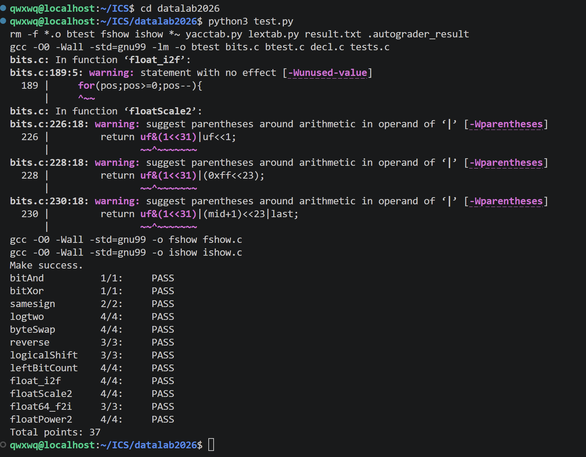

# datalab 报告

姓名：徐文庆

学号：2025201712


| 总分 | bitAnd | bitXor | logtwo | byteSwap | reverse | samesign | logicalShift | leftBitCount | float_i2f | floatScale2 | float64_f2i | floatPower2 |
| --------- | ------------- | ------------- | ------------- | ------------- | ----------------- |-----------|-----------|-----------|-----------|-----------|-----------|-----------|
| 37 | 1 | 1 | 4 | 4 | 3 | 2 | 3 | 4 | 4 | 4 | 3 | 4 |


test 截图：




# 解题报告


## 亮点

1. float_i2f
2. leftBitCount
3. logtwo


---

## float_i2f


### 解题代码

```c
if(x==0)
    return 0;

if(x==0x80000000)
    return 0xcf000000;

int shift=pos-23;
int frac=x>>shift;

int lost=x-(frac<<shift);
int half=1<<(shift-1);

if(lost>half-(frac&1)){
    frac++;
}

return sign|(((pos+126)<<23)+frac);
```


### 解题思路

该函数实现整数到 IEEE754 单精度浮点数的转换。

首先根据整数符号确定 sign 位，并特殊处理：

- x=0；
- x=INT_MIN。


之后寻找整数最高有效位 `pos`。


浮点数存储指数为：

\[
exp=pos+127
\]


当有效位不超过 23 位时，可以直接移动得到 fraction。


当有效位超过 23 位时，需要舍去低位并进行舍入。


设：

\[
lost=x-(frac<<shift)
\]

表示被舍去部分。


采用 round-to-even：

- 小于一半：不进位；
- 大于一半：fraction 加 1；
- 恰好一半：根据最低位决定是否进位。


代码中使用：

\[
(pos+126)<<23
\]

而不是：

\[
(pos+127)<<23
\]


原因是 `frac` 中保留了隐藏的最高位 bit 23，因此：

\[
((pos+126)<<23)+frac
\]

可以自动完成指数补偿。


若舍入导致 fraction 溢出，多出的部分会自动进位到 exponent。


---

## leftBitCount


### 解题代码

```c
int num1=(!~(x>>16))<<4;
x=x<<num1;

int num2=(!~(x>>24))<<3;
x=x<<num2;

/* 后续继续判断 4、2、1 位 */
```


### 解题思路

该函数统计整数最高端连续 1 的数量。


采用分治思想：

1. 判断最高 16 位；
2. 判断最高 8 位；
3. 判断最高 4 位；
4. 判断最高 2 位；
5. 判断最高 1 位。


搜索过程：

\[
32\rightarrow16\rightarrow8\rightarrow4\rightarrow2\rightarrow1
\]


通过不断缩小范围减少操作次数。


---

## logtwo


### 解题代码

```c
int shift1=(v>65535)<<4;
v=v>>shift1;

int shift2=(v>255)<<3;
v=v>>shift2;

/* 后续继续判断 4、2、1 位 */
```


### 解题思路

该函数计算：

\[
\lfloor\log_2(v)\rfloor
\]


本质是寻找最高有效位。


采用二分查找：

- 判断高 16 位；
- 判断高 8 位；
- 判断高 4 位；
- 判断高 2 位；
- 判断最高 1 位。


最终累计移动次数即为答案。


---

## 其他整数位运算函数


### bitXor

利用：

\[
x\oplus y=(x|y)\&\sim(x\&y)
\]


再根据德摩根律：

\[
x|y=\sim(\sim x\&\sim y)
\]


转换为只使用 `~` 和 `&` 的形式。


### byteSwap

通过移位和掩码提取两个 byte：

\[
(x>>(8n))\&0xff
\]


清除原位置后，再将两个 byte 放入交换后的位置。


### reverse

初始化：

```c
res=0
```

循环 32 次，每次取最低位：

\[
v\&1
\]


并加入结果：

\[
res=(res<<1)|(v\&1)
\]


实现 bit 顺序反转。


### samesign

先处理 0 的特殊情况，再通过比较两个整数最高符号位判断是否同号。


### logicalShift

通过构造 mask 清除算术右移补充的符号位，实现逻辑右移。


---

## 其他浮点函数


### floatScale2

根据 exponent 分类：

- exponent=255：保持原值；
- exponent=0：调整 fraction；
- 其他情况：指数加一。


---

### float64_f2i

首先计算：

\[
E=e-1023
\]

其中 e 为 double 的 exponent 字段。


然后分类：


**E<0 的情况：**

结果小于 1，返回 0。


**E≥31 的情况：**

超过 int 范围，返回 `0x80000000`。


**其他情况：**

根据 fraction 恢复整数部分，并根据 sign 位确定正负。


---

### floatPower2

根据结果范围分类：


**下溢情况：**

\[
x<-149
\]

无法表示，返回 0。


**非规格化情况：**

\[
-149\le x<-126
\]

使用 fraction 表示。


**规格化情况：**

\[
-126\le x\le127
\]

指数：

\[
exp=x+127
\]


**上溢情况：**

\[
x>127
\]

返回正无穷。


---

# 反馈/收获/感悟/总结

本次实验加深了对计算机底层数据表示的理解。通过实现位运算函数，掌握了补码表示、位操作以及利用位级方法优化算法的思想。在浮点数相关函数中，通过分析 IEEE754 表示方式，理解了计算机如何存储和处理浮点数据。同时，操作数限制也锻炼了将普通算法转换为位运算算法的能力。